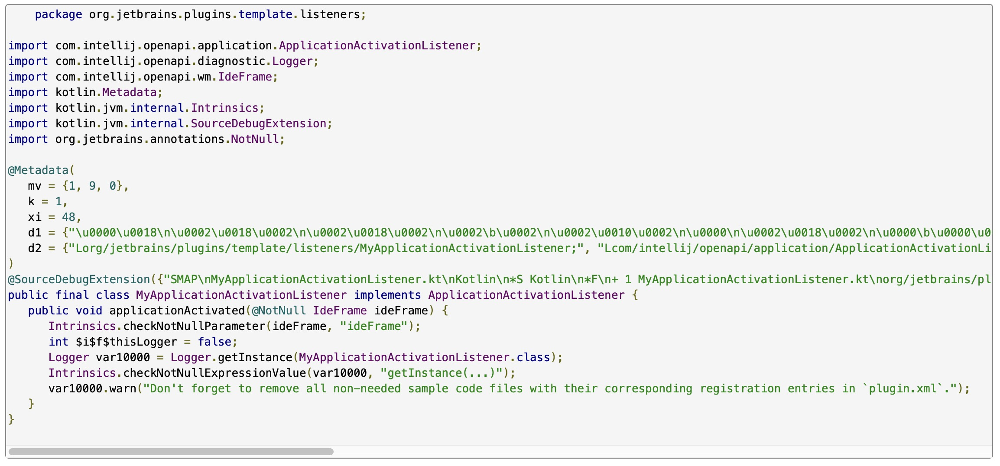
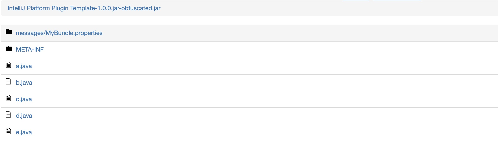
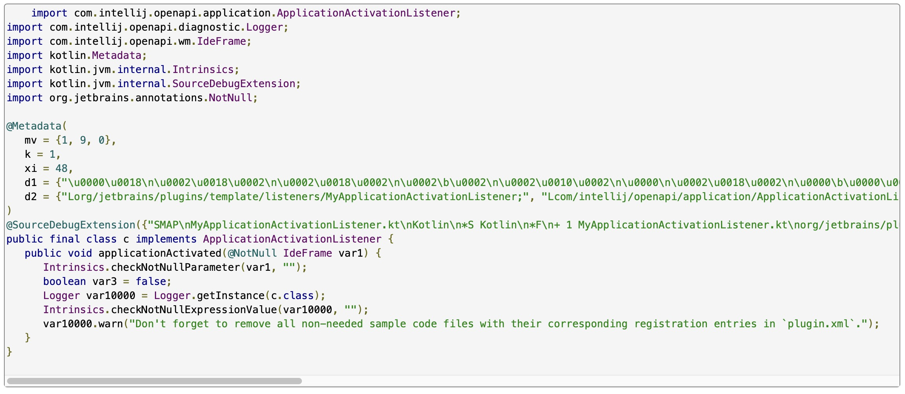

# Obfuscating IntelliJ IDEA Plugins
Protecting intellectual property is a critical concern for software developers, and IntelliJ IDEA plugin developers are no exception. Code obfuscation is a crucial technique employed to safeguard source code from unauthorized access, reverse engineering, and potential exploitation. This article delves into the intricacies of obfuscating IntelliJ IDEA plugins, exploring various methods, tools, and ethical considerations involved. [cite: 1, 2, 3]

## Tools and Libraries for Obfuscating IntelliJ IDEA Plugins 

A variety of tools and libraries are available to assist developers in obfuscating their IntelliJ IDEA plugins. Some popular options include: [cite: 4, 5]

* **Zelix KlassMaster**: A commercial Java obfuscator known for its robust features and ability to handle complex obfuscation scenarios. It offers advanced techniques like string encryption, control flow obfuscation, and the method Parameter Changes=flowObfuscate option. This option provides an additional layer of protection by complicating the decryption of scrambled string literals, making it even harder for attackers to extract sensitive information². [cite: 5, 6, 7]

* **ProGuard**: A free and open-source Java obfuscator that provides basic obfuscation features like identifier renaming and code shrinking. It can be integrated into the IntelliJ IDEA build process. ProGuard also includes the -adaptresourcefilecontents option, which is useful for adjusting obfuscated class names in plugin descriptor files. For example, using -adaptresourcefilecontents META-INF/plugin.xml ensures that class names in plugin.xml are updated to reflect the obfuscated names². [cite: 8, 9, 10]

* **yGuard**: Another free and open-source Java obfuscator that offers similar functionalities to ProGuard. It can be seamlessly integrated with IntelliJ IDEA using the IntelliGuard plugin². [cite: 11, 12]

* **IntelliGuard**: An IntelliJ IDEA plugin that simplifies the integration of yGuard into the development workflow. It provides a user-friendly interface for configuring obfuscation settings. [cite: 13, 14]

* **Taint Bomb auto Java Obfuscator**: An IntelliJ IDEA plugin that automates the obfuscation process using taint analysis to determine the level of obfuscation needed. [cite: 13, 14]

## Step-by-Step Guide to Obfuscating with proguard

ProGuard can be used to shrink, optimize, and obfuscate your Kotlin or Java code to make it less readable and reduce the size of your plugin artifacts. In an IntelliJ Plugin, ProGuard works on the JAR files containing the compiled classes. Since Kotlin code must first be compiled into a JAR, ProGuard is applied after the JAR is created as part of the build process. Below is a step-by-step guide on how to integrate ProGuard into your IntelliJ Plugin project.

**Step 1: Add ProGuard Dependency**

To use ProGuard in Gradle, you need to add the ProGuard plugin dependency. Add the following to your buildscript block:

```
buildscript {
    dependencies {
        classpath("com.guardsquare:proguard-gradle:7.3.2")
    }
}
```

This ensures that the ProGuard Gradle plugin is available in your project. [cite: 19, 20]

**Step 2: Define a ProGuard Task**

The ProGuard task must be configured to specify the input (the plugin's compiled JAR file) and the output (the obfuscated JAR). It should also include necessary ProGuard rules to guide the obfuscation. Note: Kotlin files need to be compiled into jar file. Proguard accepts only jar files [cite: 21, 22, 23]
OK, let's break down this code snippet step by step. This is a Gradle task definition for ProGuard, a tool used for code obfuscation. Obfuscation makes your code harder to reverse engineer while still functional.

```groovy
tasks.register<ProGuardTask>("proguard") {
    group = "build"
    description = "Obfuscate plugin JAR using ProGuard"

    // Declare explicit dependency on the `jar` task or `composedJar` task
    dependsOn("composedJar")

    // Specify input JAR from `composedJar` output
    val inputJar = file("build/libs/IntelliJ Platform Plugin Template-1.0.0.jar")
    injars(inputJar)

    // Specify output JAR
    val outputObfuscatedJar = file("build/obfuscated/output/IntelliJ Platform Plugin Template-1.0.0.jar-obfuscated.jar")
    outjars(outputObfuscatedJar)
    
    //Java Config
    libraryjars(configurations.compileClasspath.get())

    dontshrink()
    dontoptimize()

    adaptclassstrings("**.xml")
    adaptresourcefilecontents("**.xml")

    // Allow methods with the same signature, except for the return type,
    // to get the same obfuscation name.
    overloadaggressively()

    // Put all obfuscated classes into the nameless root package.
    repackageclasses("")
    dontwarn()

    printmapping("build/obfuscated/output/IntelliJ Platform Plugin Template-1.0.0-ProGuard-ChangeLog.txt")

    target("1.0.1")

    adaptresourcefilenames()
    optimizationpasses(9)
    allowaccessmodification()
}
```

**Explanation:**
*   `dontshrink()`: Disables code shrinking, a feature that removes unused code.
*   `dontoptimize()`: Disables code optimization.
*   `adaptclassstrings("**.xml")`: Updates class names in XML files (like your plugin's configuration files) to match the obfuscated names.
*   `adaptresourcefilecontents("**.xml")`: Similar to the previous line, but it adapts the content of resource files as well.
*   `overloadaggressively()`: This allows ProGuard to use the same obfuscated name for different methods if they have the same signature (parameters), even if they have different return types.
*   `repackageclasses("")`: Repackages all obfuscated classes into the root package.
*   `dontwarn()`: Suppresses warnings from ProGuard. Use with caution, as warnings can sometimes indicate problems.
*   `printmapping("build/obfuscated/output/IntelliJ Platform Plugin Template-1.0.0-ProGuard-ChangeLog.txt")`: Creates a file that maps the original class and method names to their obfuscated names. This is crucial for debugging if you get crash reports from users.
*   `adaptresourcefilenames()`: This option adapts resource filenames to reflect the obfuscated class names. It ensures that resources with names based on class names are correctly renamed after obfuscation.
*   `optimizationpasses(9)`: This line sets the number of optimization passes ProGuard will perform. More passes can lead to smaller code size but take longer to process. The value 9 indicates that ProGuard will perform 9 passes to optimize the code.
*   `allowaccessmodification()`: This option allows ProGuard to modify access modifiers of classes and class members (e.g., changing `private` to `public`). This can be useful for more aggressive obfuscation but might break code that relies on specific access levels.

**Step 3: Hook ProGuard into the Build Lifecycle**

You need to ensure that the ProGuard task runs before tasks like prepareSandbox (used for the IntelliJ plugin sandbox) or buildPlugin (used to generate the final plugin artifact). Update the dependencies for these tasks:

For prepareSandbox:

Modify the prepareSandbox task to use the obfuscated JAR if ProGuard is enabled:

```
tasks.prepareSandbox {
            dependsOn("proguard")
            pluginJar.set(File("build/obfuscated/output/instrumented-IntelliJ Platform Plugin Template-1.0.0.jar"))
}
```

For buildPlugin:

Add a dependency to ensure ProGuard runs before building the plugin:

```
tasks.named("buildPlugin") {
    dependsOn("proguard") // Ensure the obfuscated JAR is used for the final build
}
```

**Step 4: Add ProGuard Rules**

ProGuard requires customization of its rules based on the project. For Kotlin-based IntelliJ plugins, the following rules are typically needed:

```
#Keep IntelliJ Platform and Kotlin references to avoid breaking functionality
-keepclassmembers class * {
    public static <methods>;
}

#Keep IntelliJ-specific configuration
-keep class com.intellij.** {*; }
-keepattributes *Annotation*

#Preserve Kotlin metadata
-keepclassmembers class kotlin.Metadata {*;}

#Preserve persistent state components
keep class implements com.intellij.openapi.components.PersistentStateComponent {*; }

#Keep all enums for runtime usage
-keepclassmembers enum* {*;}

#Preserve any serializable classes
-keepclassmembers class implements java.io.Serializable { static final long serialVersionUID; private static final java.io.ObjectStreamField[] serialPersistentFields; private void writeObject(java.io.ObjectOutputStream); private void readObject(java.io.ObjectInputStream); private java.lang.Object writeReplace(); private java.lang.Object readResolve(); }

#Preserve data classes, companion objects, and static methods
-keepclassmembers class * {
    public static ** INSTANCE;
}
```

These rules must be customized depending on your plugin's needs and specific API usage. [cite: 28, 29, 30, 31, 32, 33, 34, 35]

## Results
- ### Before Obfuscation
  

  

- ### After Obfuscation
  
  
  


## References

1.  The Power of Obfuscation Techniques in Malicious JavaScript Code: A Measurement Study, accessed December 18, 2024, [https://www.cse.psu.edu/\~sxz16/papers/malware.pdf](https://www.google.com/url?sa=E&source=gmail&q=https://www.cse.psu.edu/~sxz16/papers/malware.pdf) [cite: 36]

2.  Obfuscate the plugin | JetBrains Marketplace Documentation, accessed December 18, 2024, [https://plugins.jetbrains.com/docs/marketplace/obfuscate-the-plugin.html](https://www.google.com/url?sa=E&source=gmail&q=https://plugins.jetbrains.com/docs/marketplace/obfuscate-the-plugin.html) [cite: 37]

3.  Unraveling Obfuscation: Understanding the Art of Concealment - Soup.io, accessed December 18, 2024, [https://www.soup.io/unraveling-obfuscation-understanding-the-art-of-concealment](https://www.google.com/url?sa=E&source=gmail&q=https://www.soup.io/unraveling-obfuscation-understanding-the-art-of-concealment) [cite: 38]

4.  Guest Post: The Plugin Obfuscation Experience | The JetBrains Platform Blog, accessed December 18, 2024, [https://blog.jetbrains.com/platform/2022/05/the-plugin-obfuscation-experience/](https://www.google.com/url?sa=E&source=gmail&q=https://blog.jetbrains.com/platform/2022/05/the-plugin-obfuscation-experience/) [cite: 39]

5.  Taint Bomb auto Java Obfuscator - IntelliJ IDEs Plugin - JetBrains Marketplace, accessed December 18, 2024, [https://plugins.jetbrains.com/plugin/25629-taint-bomb-auto-java-obfuscator](https://www.google.com/url?sa=E&source=gmail&q=https://plugins.jetbrains.com/plugin/25629-taint-bomb-auto-java-obfuscator)

6.  How can I obfuscate a jar in IntelliJ? - Stack Overflow, accessed December 18, 2024, [https://stackoverflow.com/questions/66801590/how-can-i-obfuscate-a-jar-in-intellij](https://www.google.com/url?sa=E&source=gmail&q=https://stackoverflow.com/questions/66801590/how-can-i-obfuscate-a-jar-in-intellij) [cite: 41]

7.  Techniques of Program Code Obfuscation for Secure Software - ResearchGate, accessed December 18, 2024, [https://www.researchgate.net/publication/235611093](https://www.google.com/url?sa=E&source=gmail&q=https://www.researchgate.net/publication/235611093) Techniques of Program Code Obfuscation for Secure Software [cite: 42]

8.  A Study & Review on Code Obfuscation | Request PDF - ResearchGate, accessed December 18, 2024, [https://www.researchgate.net/publication/322520412](https://www.google.com/url?sa=E&source=gmail&q=https://www.researchgate.net/publication/322520412) A Study Review on Code Obfuscation

9.  The Effectiveness of Source Code Obfuscation: an Experimental Assessment, accessed December 18, 2024, [https://www.researchgate.net/publication/221219550](https://www.google.com/url?sa=E&source=gmail&q=https://www.researchgate.net/publication/221219550) The Effectiveness of Source Code Obfuscation an Experimental Assessment

10. Protecting Software through Obfuscation: Can It Keep Pace with Progress in Code Analysis?, accessed December 18, 2024, [https://www.plai.ifi.lmu.de/publications/csur16-obfuscation.pdf](https://www.google.com/url?sa=E&source=gmail&q=https://www.plai.ifi.lmu.de/publications/csur16-obfuscation.pdf)

11. Code Obfuscation: Protecting Your Software's Inner Workings - Verimatrix, accessed December 18, 2024, [https://www.verimatrix.com/cybersecurity/knowledge-base/the-power-of-code-obfuscation/](https://www.google.com/url?sa=E&source=gmail&q=https://www.verimatrix.com/cybersecurity/knowledge-base/the-power-of-code-obfuscation/)

12. Cryptographic obfuscation - (Cryptography) - Vocab, Definition, Explanations | Fiveable, accessed December 18, 2024, [https://fiveable.me/key-terms/cryptography/cryptographic-obfuscation](https://www.google.com/url?sa=E&source=gmail&q=https://fiveable.me/key-terms/cryptography/cryptographic-obfuscation)

13. Unlocking the Vault, Exposing the Risks: Al and Proprietary Code - Distillery, accessed December 18, 2024, [https://distillery.com/blog/unlocking-the-vault-exposing-the-risks-ai-and-proprietary-code/](https://www.google.com/url?sa=E&source=gmail&q=https://distillery.com/blog/unlocking-the-vault-exposing-the-risks-ai-and-proprietary-code/)

14. A Framework to Quantify the Quality of Source Code Obfuscation - MDPI, accessed December 18, 2024, [https://www.mdpi.com/2076-3417/14/12/5056](https://www.google.com/url?sa=E&source=gmail&q=https://www.mdpi.com/2076-3417/14/12/5056)

15. Code obfuscation - Cybersecurity ASEE, accessed December 18, 2024, [https://cybersecurity.asee.io/code-obfuscation/](https://www.google.com/url?sa=E&source=gmail&q=https://cybersecurity.asee.io/code-obfuscation/)